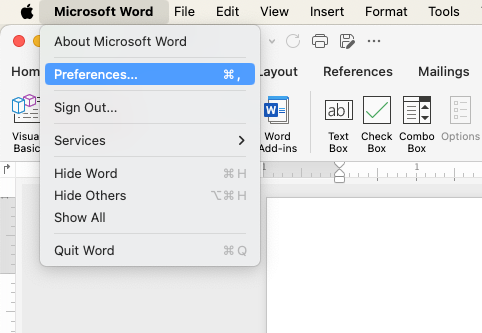
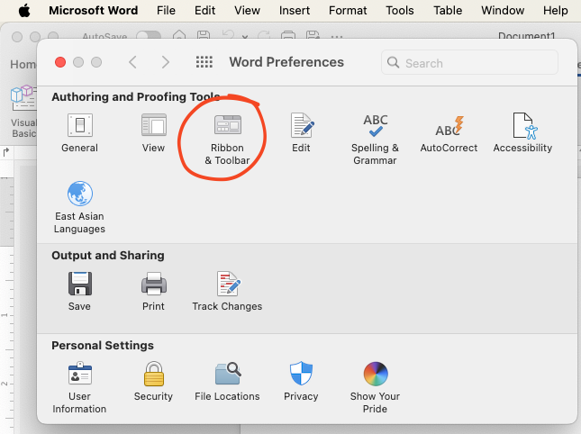
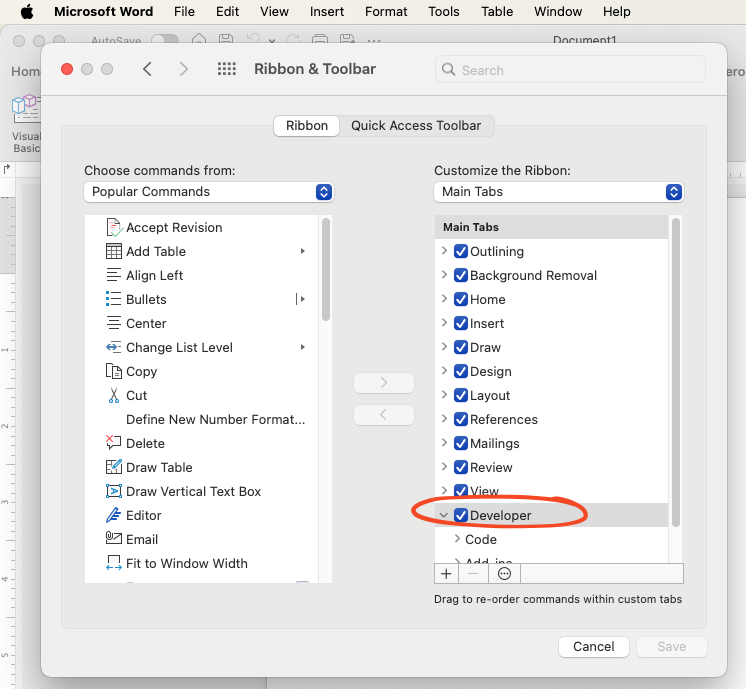
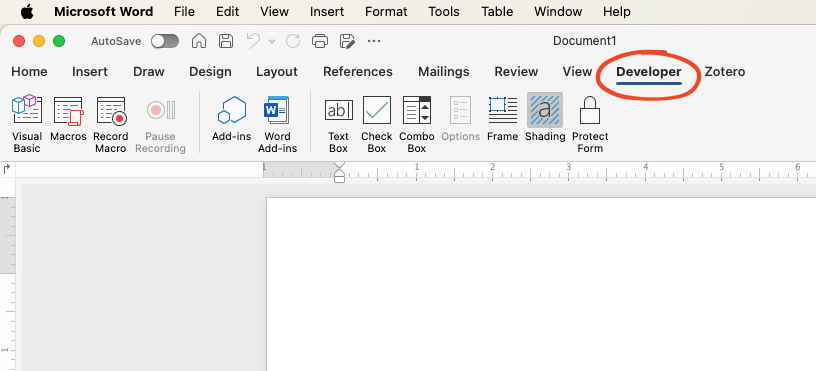

# Enabling Developer Tab

To use macros in Microsoft Word, the Developer tab must first be
enabled. The Developer tab provides access to advanced tools, including
options for creating and running macros. Follow the steps below to
enable the Developer tab in Word.

## Steps for macOS

1.  **Open Word Preferences**:
    -   Open Microsoft Word.\
    -   Click on the **Microsoft Word** menu in the top-left corner of
        your screen and select **Preferences**.
        

2.  **Access Ribbon and Toolbar Settings**:
    -   In the Preferences window, click on **Ribbon and Toolbar**.

3.  **Enable Developer Tab**:
    -   In the Ribbon and Toolbar settings, locate the **Customize the
        Ribbon** section.\
    -   Under the list of main tabs, find **Developer** and check the
        box next to it.\
    -   Click **Save** to apply the changes.
    

    
    
    
4.  **Verify**:
    -   The Developer tab should now appear in the Word toolbar at the
        top of the window.
        

## Steps for Windows

1.  **Open Word Options**:
    -   Open Microsoft Word.\
    -   Click on the **File** tab and then select **Options**.
2.  **Access Customize Ribbon Settings**:
    -   In the Word Options dialog, click on **Customize Ribbon** in the
        left-hand menu.
3.  **Enable Developer Tab**:
    -   In the Customize Ribbon section, locate the list of Main Tabs.\
    -   Find **Developer** in the list and check the box next to it.\
    -   Click **OK** to save your changes.
4.  **Verify**:
    -   The Developer tab should now be visible in the Word toolbar at
        the top of the window.

\

------------------------------------------------------------------------

Once the Developer tab is enabled, you're ready to start working with
macros! Proceed to the next chapter to learn how to create and run your
first macro.

------------------------------------------------------------------------

\

\

How to run macros in Microsoft Word © 2024 by Ville Langén is licensed under the  
[CC BY-SA 4.0](https://creativecommons.org/licenses/by-sa/4.0/?ref=chooser-v1).

