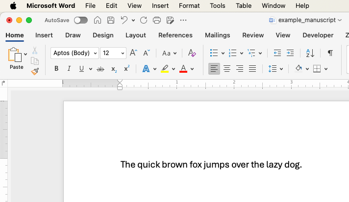
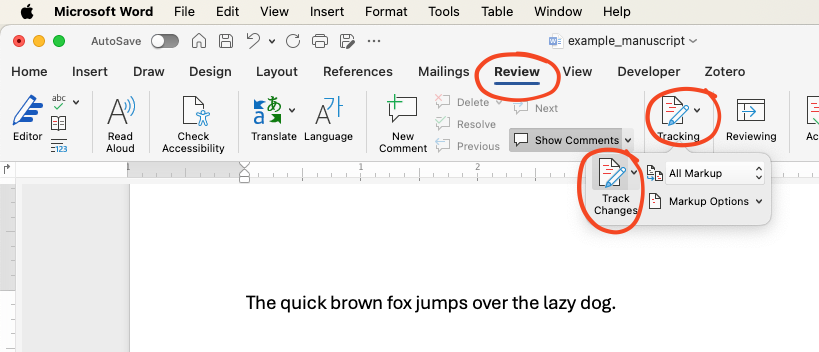
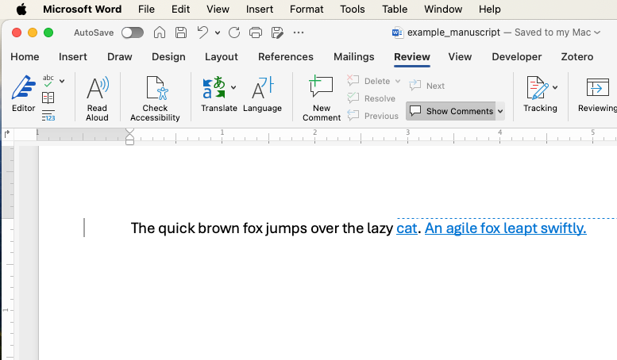

# Sample Manuscript

Before running the macro, you’ll need a sample manuscript loaded into Word. Below is a short example of an imaginary manuscript with tracked changes. Copy and paste this text into a new Word document:

---

**Sample Manuscript:**  

1. Write the original version: "The quick brown fox jumps over the lazy dog."

\

\

2. At this point, enable Track Changes:

\

\

3. Edit with Track Changes enabled followingly:  
   - "The quick brown fox jumps over the lazy **cat**."  
   - **Inserted:** "An agile fox leapt swiftly."  

\

---

Once you’ve pasted this sample into Word, ensure Track Changes is turned on and visible. Now proceed with adding and running the macro as described in the next section.
