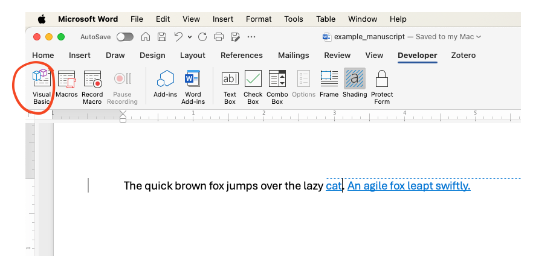
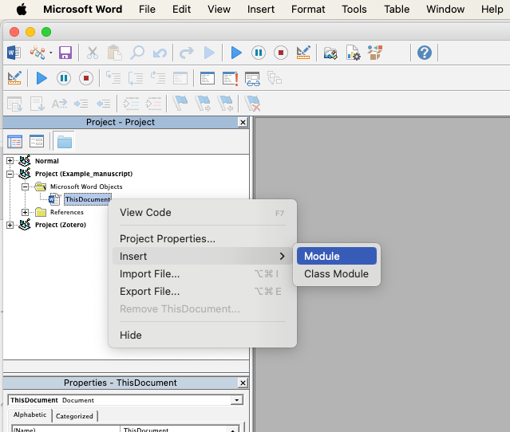
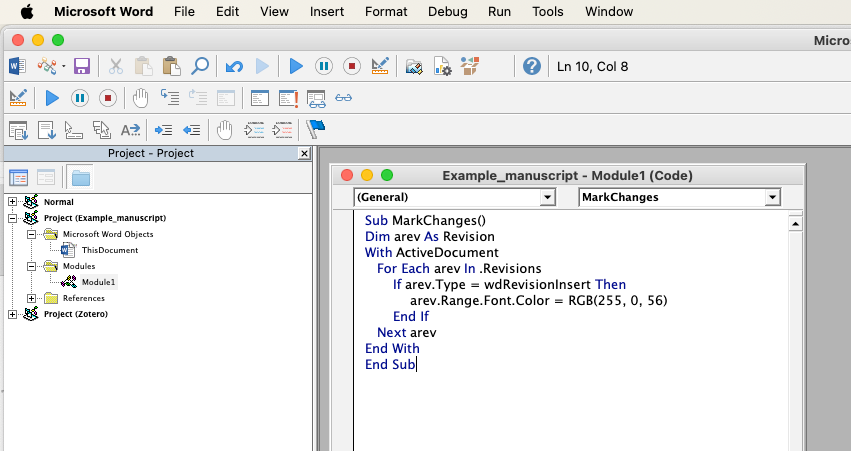
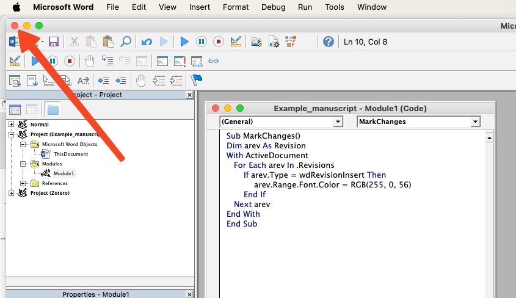
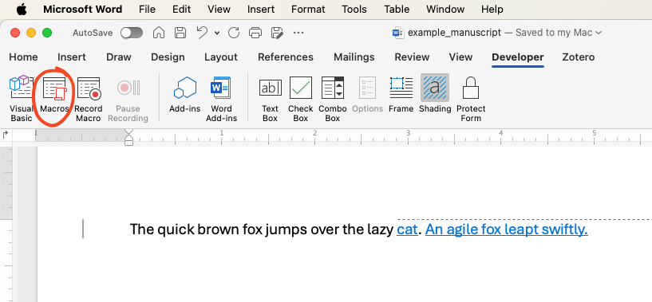
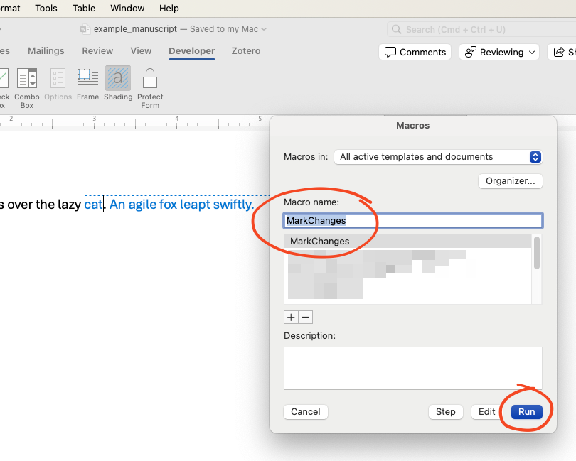
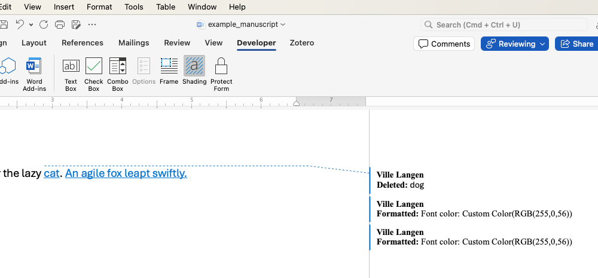
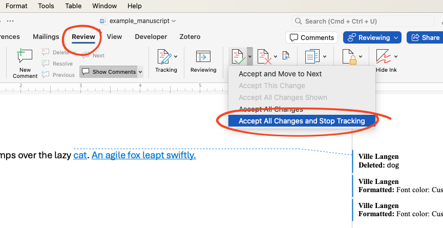
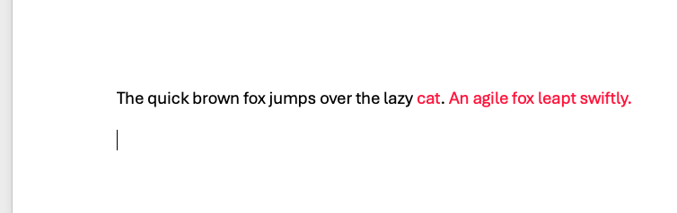

# Running the Macro

Now that you have the sample manuscript loaded in Word, follow these
steps to add and run the `MarkChanges` macro. This macro highlights
insertions marked by Track Changes in red.

## Open the VBA Editor

1.  Ensure the **Developer tab** is enabled (see Chapter 1 if it
    isn’t).\
2.  Click on the **Developer tab** in the Word toolbar.\
3.  Click on the **Visual Basic** icon.




## Add the Macro Code

1.  In the VBA Editor, locate your Word document in the **Project
    Explorer** panel on the left.

    -   If the Project Explorer is not visible, click **View \> Project
        Explorer**.\

\

2.  Right-click on the document name (e.g., `ThisDocument`) and select
    **Insert \> Module**.\

\



\

3. A new module window will open. Copy and paste the following code into the module, which is referenced from [this post on SuperUser](https://superuser.com/questions/1235616/how-to-select-all-deleted-or-all-added-text-track-change-in-ms-word-2016), courtesy of Stack Exchange Inc. (with user contributions licensed under CC BY-SA):


\

```
Sub MarkChanges()
    Dim arev As Revision
    With ActiveDocument
        For Each arev In .Revisions
            If arev.Type = wdRevisionInsert Then
                arev.Range.Font.Color = RGB(255, 0, 56)
            End If
        Next arev
    End With
End Sub
```

\



\


4.  Close the VBA Editor by clicking the X in the top-left corner (on
    Mac) or pressing Command + Q (macOS) / Alt + Q (Windows).

\




\


## Run the Macro

You have now returned to the Word Document.

\

1.  Click on the Developer tab and select Macros.

\



\

2.  In the Macros dialog box:

-   Find the macro named MarkChanges in the list.
-   Click Run.

\



\

## Accept All Changes

-   After running the macro, all text insertions marked by Track Changes
    in your sample manuscript will be displayed in red. This might not
    be immediately apparent, as Track Changes is still enabled.

\
    


\

-   However, when you click **Accept All Changes and Stop Tracking**,
    the effect of the macro will become visible.

\



\


## Verify the Results

Once the macro has been run and the changes accepted, your document should now display all insertions in red, as shown in the screenshot below.

\



\

------------------------------------------------------------------------

Congratulations! You’ve successfully run the MarkChanges macro. This
approach makes revisions permanent and visually distinct, even after
turning off Track Changes. 

